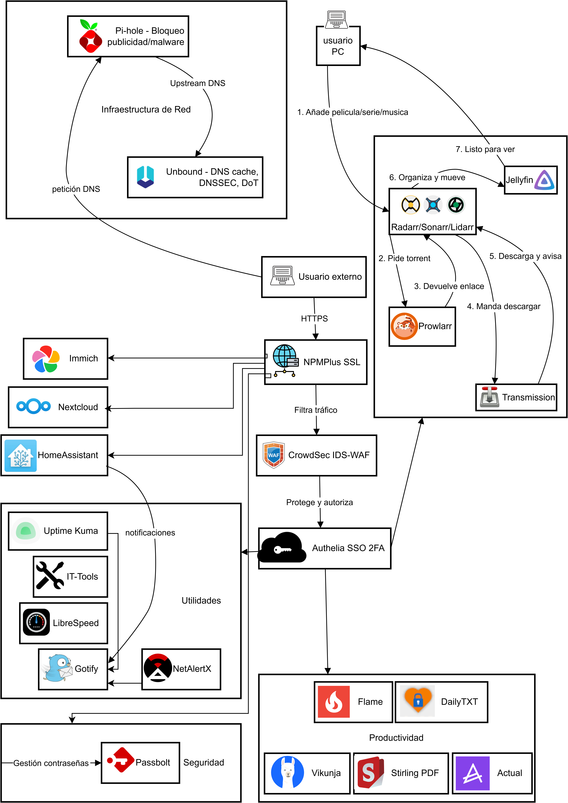

# Sovereign-Homelab-ASIR

Infraestructura homelab dockerizada para el módulo de Administración de Sistemas Informáticos en Red (ASIR).  
Este proyecto está orientado a la soberanía digital, la replicabilidad y el aprendizaje, y puede servir tanto como entorno de pruebas como base para despliegues reales.

---
## 🖼️ Arquitectura general


---

## 🚀 Descripción

**Sovereign-Homelab-ASIR** es un proyecto de homelab autohospedado, basado en tecnologías libres (Docker, Proxmox, Home Assistant…), que integra múltiples servicios útiles en administración, automatización, productividad y seguridad.

Pensado para el módulo de Proyecto ASIR, pero abierto a la comunidad y cualquier usuario interesado en montarse un homelab moderno, seguro y fácil de mantener.

## 📝 Requisitos mínimos y versiones probadas

Este proyecto está pensado para funcionar **sobre Ubuntu Server** utilizando contenedores Docker, aunque **se recomienda** su despliegue en una máquina virtual gestionada por Proxmox para facilitar el aislamiento, las copias de seguridad y la escalabilidad.

**Entorno probado:**
- **Ubuntu Server:** 24.04.2 LTS (`noble`)
- **Docker:** 28.2.2
- **Docker Compose:** v2.36.2

**Requisitos mínimos recomendados:**
- Procesador x86_64 con soporte de virtualización (2 o más núcleos recomendados)
- 8 GB o más recomendado para múltiples servicios
- 60 GB de espacio libre en disco (SSD preferible y HDD de gran capacidad para multimedia recomendado)
- Acceso a Internet para descargar imágenes y actualizaciones
- Conexión de red local para acceder a los servicios
- **Opcional pero recomendado:** Proxmox VE como hipervisor para alojar Ubuntu Server y por otro lado Home AssistantOS para facilitar snapshots, backup y escalabilidad

**Nota:**  
El proyecto debería funcionar en otros sistemas Linux compatibles con Docker, pero sólo se garantiza el funcionamiento sobre las versiones arriba indicadas.

---

## 🚀 Instalación rápida

1. **Clona el repositorio:**
    ```bash
    git clone https://github.com/CLAlberto/Sovereign-Homelab-ASIR.git
    cd Sovereign-Homelab-ASIR
    ```

2. **Copia los archivos `.env.example` a `.env` y personaliza los valores según tus necesidades:**
    ```bash
    find . -name ".env.example" -exec sh -c 'cp "$0" "${0%.example}"' {} \;
    ```

3. **Edita los archivos de configuración que lo requieran**  
   (por ejemplo: archivos en `docker/authelia/config/`, `docker/crowdsec/config/acquis.yaml`, etc.), siguiendo las instrucciones de los `.md` en la carpeta `docs/`.

4. **Arranca los servicios que necesites:**
    ```bash
    cd docker/nextcloud
    docker compose up -d
    # ...igual para los demás servicios.
    ```

5. **Configura el acceso web seguro a los servicios:**
    - **Entra a NPMplus** desde tu navegador (por defecto http://IP_DEL_SERVIDOR:81).
    - Añade tus **proxy hosts** (dominios o subdominios) apuntando a cada contenedor y configura los certificados SSL Certbot con la API de Porkbun u otro proveedor para HTTPS.
    - Opcionalmente, añade protección con **Authelia** para SSO y control de acceso.
    - **Recuerda:** Hasta que no configures NPMplus, **NO tendrás acceso a los servicios web** (salvo al propio NPMplus).

> **Nota:**  
> Toda la configuración especifica de NPMplus, integración con Authelia, crowdsec, unbound, generación de secrets.... está explicado en la carpeta `docs/`.

## 📝 Nota importante sobre el acceso y la arquitectura

- Este proyecto **no expone los servicios directamente al exterior** (excepto el proxy reverso NPMplus).
- **Debes configurar NPMplus** como proxy inverso para exponer cada servicio, añadir certificados HTTPS, reglas de acceso y protección con Authelia (SSO).
- Como he dicho antes, todos los detalles de red, dominios y seguridad se encuentran documentados en la carpeta `/docs`.

---

## 🛠️ Características principales

- **Despliegue completo con Docker Compose** para todos los servicios.
- Documentación detallada en español.
- Integración de servicios como Nextcloud, Jellyfin, Pi-hole, Home Assistant, Vikunja, Authelia, CrowdSec, y muchos más.
- Seguridad y privacidad: SSO con Authelia, protección activa con CrowdSec mediante bouncer de NPM, configuración avanzada de red y DNS encriptado.
- En desarrollo: Automatización de tareas domésticas y agrícolas (Home Assistant + sensores).
- Scripts y ejemplos prácticos para backup, actualización, logs y más.

---

## 📦 Estructura del repositorio

- `docker/` — Todos los servicios dockerizados, con sus plantillas y configuración.
- `docs/` — Manuales y documentación de cada servicio/configuración clave.
- `scripts/` — Scripts auxiliares y ejemplos de automatización.
- `home-assistant/` — Configuración de Home Assistant para que acepte dominio y SSL de NPMPlus.
- `library/` — Directorio de recursos multimedia (música, fotos y videos).
- `tests/` — (Opcional) Tests o pruebas adicionales.

---

## 📄 Licencia

Este proyecto se distribuye bajo la licencia [MIT](LICENSE), lo que significa que puedes usarlo, adaptarlo y compartirlo libremente, siempre que menciones la autoría original.

---

## 🙋 Autoría

Desarrollado y mantenido por [Alberto López Carrillo](https://github.com/CLAlberto).  
Inspirado y motivado por la comunidad open source y la necesidad de soberanía digital en entornos domésticos.

---

## 🤝 Contribuciones y contacto

Si quieres aportar mejoras, detectas algún error o tienes sugerencias, ¡eres bienvenido a abrir issues o pull requests!  
Para consultas, puedes contactar en [albertolc1991@gmail.com] o abrir un issue en el repositorio.

---

## ⚠️ Aviso legal y ético

Este proyecto se ofrece **tal cual**, sin garantía alguna.  
Úsalo bajo tu propia responsabilidad, respeta la legislación vigente y nunca utilices los servicios aquí descritos para actividades ilícitas.

---

## ✨ Agradecimientos

Gracias a toda la comunidad de software libre, a mis profesores y compañeros de ASIR, y a quienes comparten conocimiento para que otros podamos aprender y mejorar.

---

